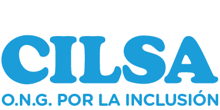

**Trabajo Práctico - Formulario**

### Sobre CILSA

CILSA es una organización no gubernamental argentina que trabaja para promover la inclusión social y la igualdad de oportunidades, especialmente de personas con discapacidad y sectores en situación de vulnerabilidad. Desarrolla programas educativos, sociales y de capacitación orientados a favorecer una sociedad más inclusiva.

 Denhoff, Lorena 